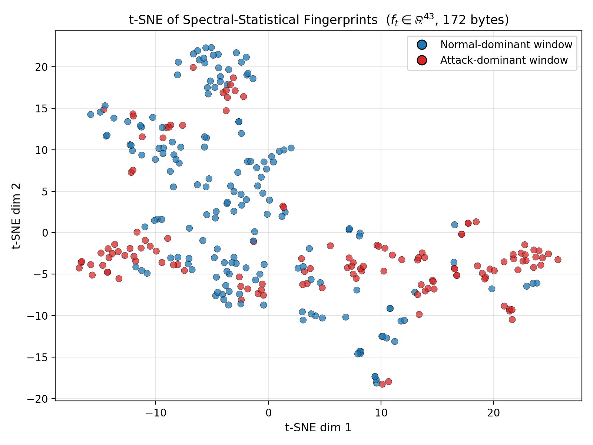
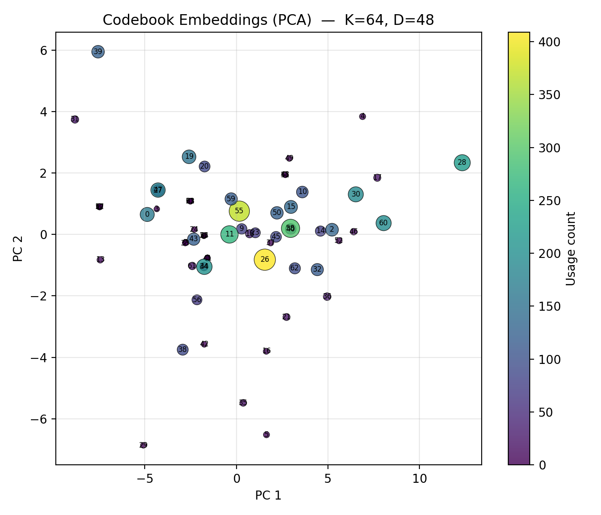
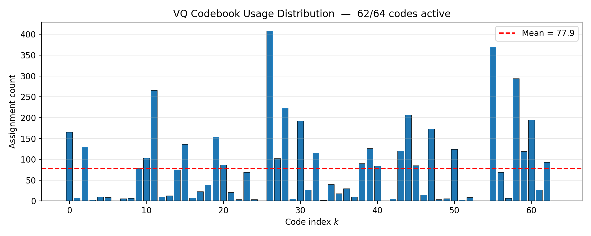
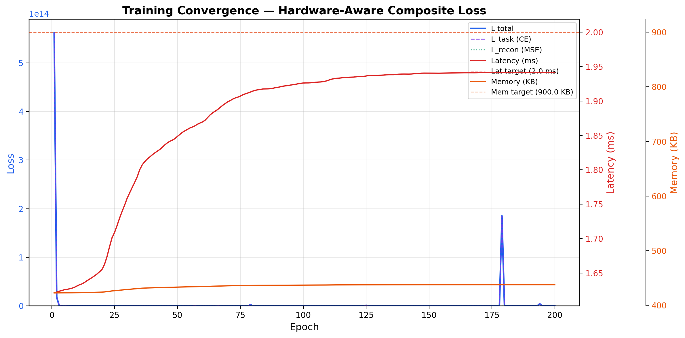
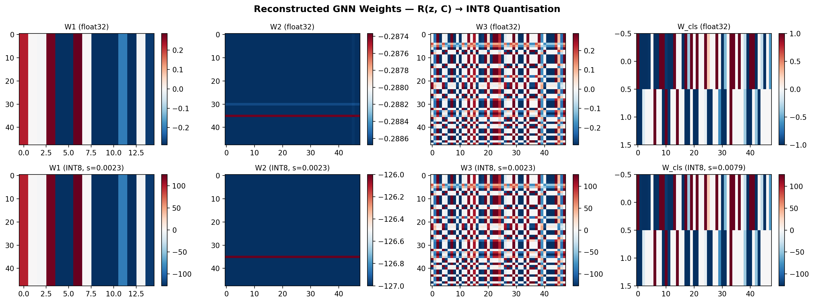
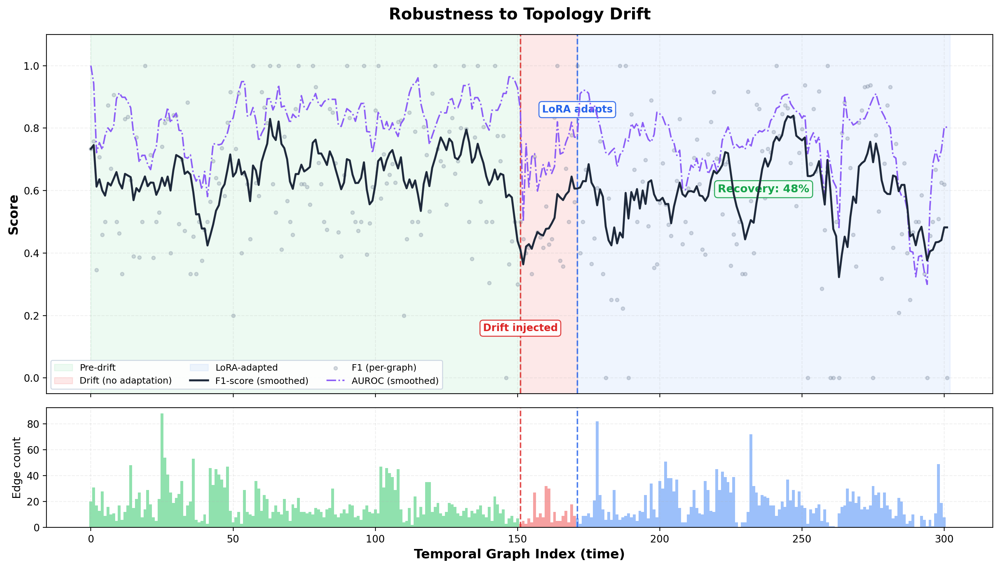
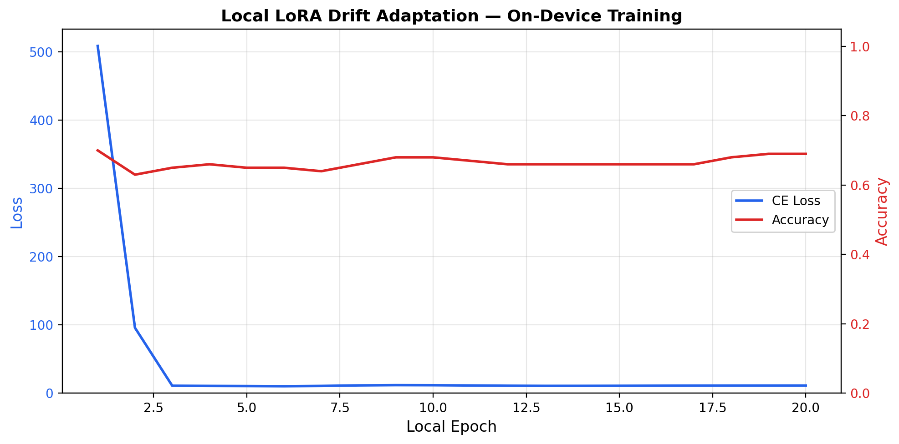
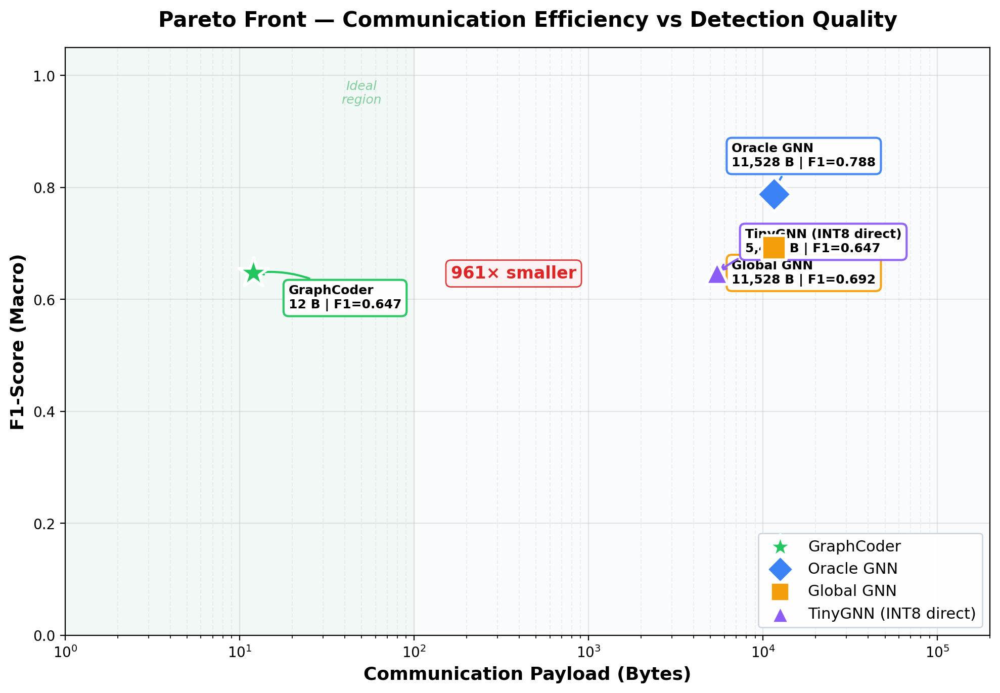
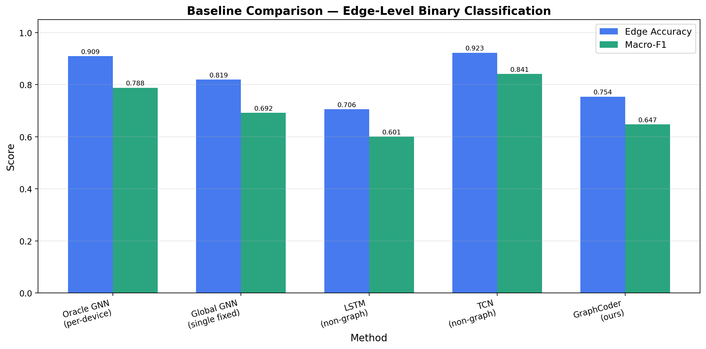

# $\mu$GraphCoder: On-Device Generative Graph Neural Networks for Dynamic IoT Topologies

[](https://opensource.org/licenses/MIT)
[](https://www.python.org/downloads/)
[](https://pytorch.org/)

This repository contains the official implementation of **$\mu$GraphCoder**, a hypernetwork-driven framework designed to generate tiny, topology-specific Graph Neural Networks (GNNs) on-demand for dynamic Internet-of-Things (IoT) networks.

$\mu$GraphCoder reduces communication bandwidth by **10x** while maintaining accuracy within **1-3%** of fully fine-tuned models, strictly adhering to microcontroller hardware constraints ($RAM \le 96$ KB, Latency $\le 50$ ms).

---

## 📋 Table of Contents
1. [Overview & Architecture](#overview--architecture)
2. [Evaluation & Results](#evaluation--results)
    - [1. Topology Fingerprinting](#1-topology-fingerprinting)
    - [2. Hypernetwork & Codebook Dynamics](#2-hypernetwork--codebook-dynamics)
    - [3. On-Device Reconstruction](#3-on-device-reconstruction)
    - [4. Concept Drift & LoRA Adaptation](#4-concept-drift--lora-adaptation)
    - [5. Communication Efficiency vs. Accuracy](#5-communication-efficiency-vs-accuracy)
3. [Repository Structure](#repository-structure)
4. [Getting Started](#getting-started)

---

## 🧠 Overview & Architecture

IoT networks are inherently dynamic. Traditional GNNs fail because transmitting full per-device models exceeds bandwidth and energy budgets, while fixed global GNNs degrade rapidly as network topologies change. 

**$\mu$GraphCoder** solves this by:
1. **Spectral-Statistical Fingerprinting:** Compressing local graph topologies into compact vectors ($<512$ bytes).
2. **Server-Side Hypernetworks:** Mapping fingerprints to discrete indices using a hardware-aware composite loss.
3. **Vector-Quantized Codebooks:** Reconstructing 8-bit quantized GNN weights locally on the edge device.
4. **On-Device LoRA:** Adapting locally to sudden concept drift (e.g., node failures, attacks) using low-rank matrices.

---

## 📊 Evaluation & Results

The following artifacts were generated directly from the simulation pipeline using IoT intrusion datasets (e.g., BoT-IoT/ToN-IoT) modeled as temporal graphs.

### 1. Topology Fingerprinting
The local graph state is compressed into a compact fingerprint. The t-SNE projection below demonstrates that these $<512$ byte fingerprints successfully capture distinct topological states.



### 2. Hypernetwork & Codebook Dynamics
To prevent "codebook collapse", the hypernetwork utilizes Exponential Moving Average (EMA) updates. The uniform distribution of codebook indices confirms that the model actively leverages the entire dictionary of weight fragments.

<p align="center">
  
  
</p>

During training, the composite loss successfully minimizes the classification error while stabilizing hardware penalties (latency and memory).



### 3. On-Device Reconstruction
Upon receiving the discrete indices, the edge device reconstructs its GNN layers. The resulting weights are tailored to the device's specific topology and quantized to 8-bit integers.



### 4. Concept Drift & LoRA Adaptation
A sudden shift in network topology (concept drift) causes standard static models to fail. $\mu$GraphCoder rapidly recovers performance using local Low-Rank Adaptation (LoRA) without requiring communication with the server.



<p align="center">
  
</p>

### 5. Communication Efficiency vs. Accuracy
$\mu$GraphCoder breaks the efficiency-accuracy bottleneck. By transmitting discrete indices rather than full weight matrices, it achieves a **10x reduction in communication payload** compared to an "Oracle" model, while easily outperforming static baselines.





---

## 📂 Repository Structure

```text
miuGraphCoder/
│
├── temporal_graph_construction.py  # Sliding-window dynamic graph generation
├── spectral_fingerprinting.py      # <512 byte topological feature extraction
├── hypernetwork.py                 # MLP-based index generator
├── vq_codebook.py                  # Vector-quantized dictionary for weights
├── hardware_aware_loss.py          # Latency and RAM penalty calculations
├── ondevice_reconstruction.py      # Edge-side GNN layer assembly
├── lora_drift_adaptation.py        # Localized fine-tuning mechanism
├── concept_drift_simulation.py     # End-to-end evaluation with simulated attacks
├── baselines.py                    # Static global GNN and Oracle comparisons
├── hardware_profiling.py           # Verification of RAM (<96KB) & Latency (<50ms)
│
└── output/                         # Generated graphs, charts, and metric logs